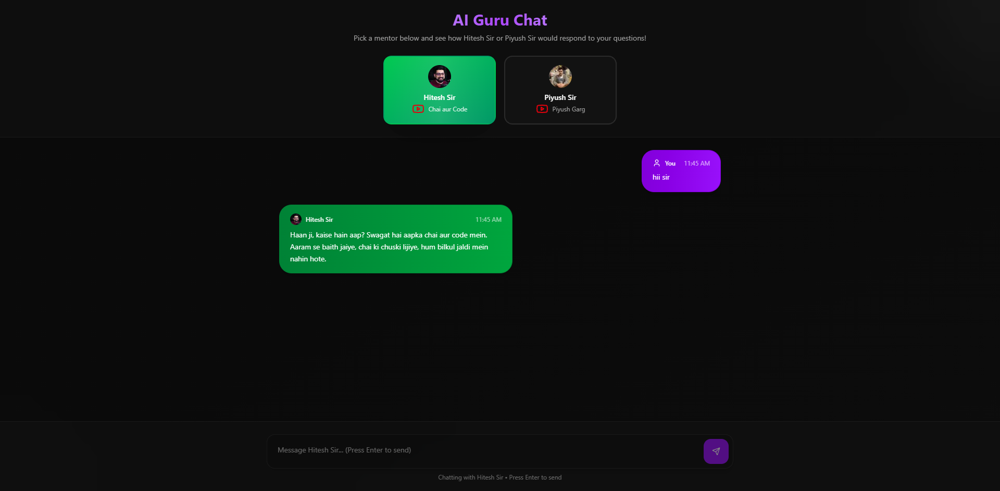

# AI Persona Chat

 
## Live Demo
Check out the live version here: [AI Persona Chat on Vercel]([https://ai-persona-chat-leoe.vercel.app/])

 
AI Persona Chat is an interactive web application that lets users converse with multiple AI-powered personas, each with their own unique style, tone, and knowledge base.
Whether you want a friendly mentor, a strict instructor, or a casual chat buddy, you can switch personas instantly and enjoy dynamic, context-aware conversations.

Key Features

🎭 Multiple Personas – Chat with different AI characters, each having distinct behavior and responses.

🔄 Persona Switching – Change AI roles on the fly without losing your conversation context.

💬 Real-time Chat – Smooth, instant message rendering with animated chat bubbles.

🎨 Modern UI – Built with Next.js, Tailwind CSS, and ShadCN UI for a sleek and responsive design.

⚡ Fast & Optimized – SSR (Server-Side Rendering) for better performance and SEO.
 
 
Tech Stack

Frontend Framework: Next.js – for fast rendering, routing, and SEO-friendly pages.

Styling: Tailwind CSS + ShadCN UI – for modern, responsive, and customizable UI components.

Icons: Lucide React – lightweight and stylish icon set.

Animation: Framer Motion – smooth animations for chat messages and persona switching.

AI Integration: Gemini API – for generating persona-based responses.

Deployment: Vercel – seamless cloud hosting with automatic builds and previews.
